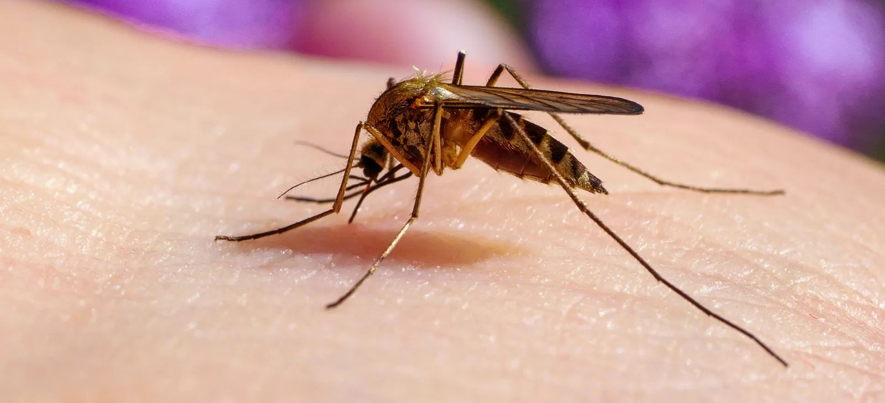
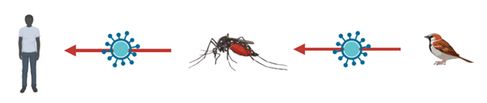
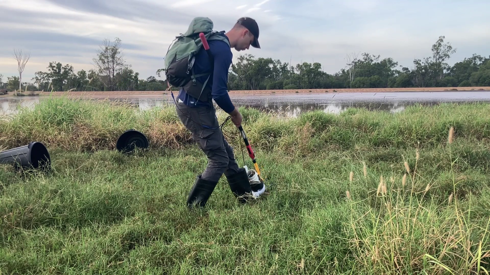
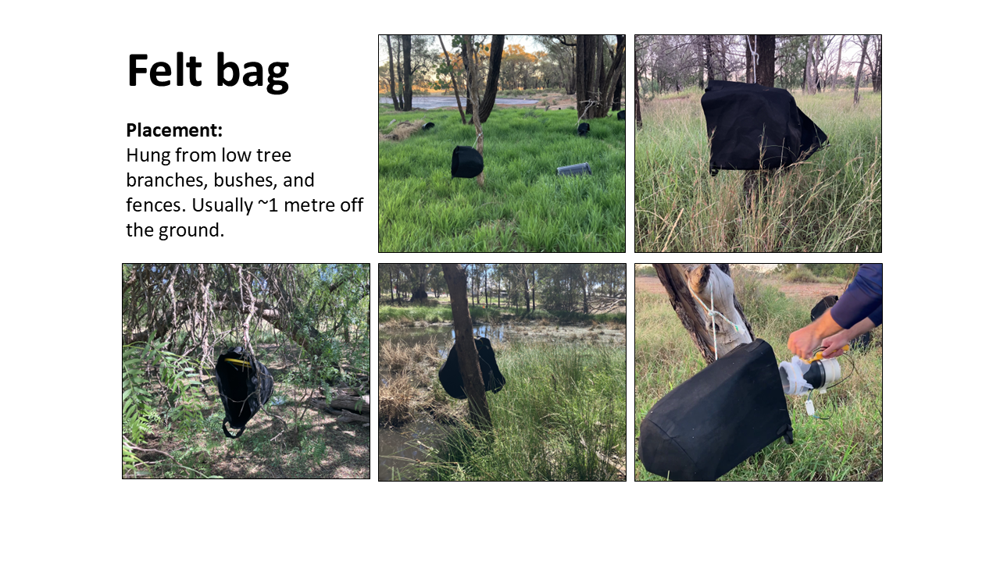
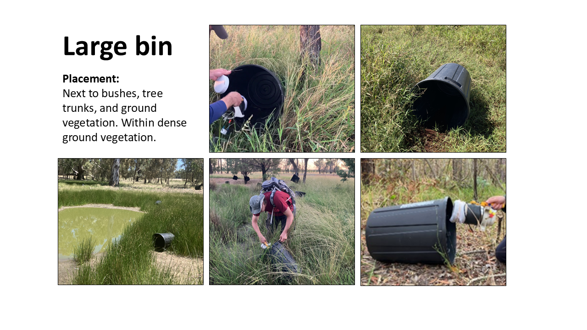

# I set out to find the best way to collect bloodfed mosquitoes 🩸

### Why collect bloodfed mosquitoes?

We use bloodfed mosquitoes to observe mosquito **feeding patterns**. For example, do they feed on birds or mammals?

And crucially . . . do they **feed on humans**?

A mosquito that feeds on both **wild animals** and **humans** could transmit a virus from the infected wild host to us!!

Therefore, each bloodfed mosquito is crucial. They provide direct evidence of a **vector-host interaction** and help us piece together the **transmission cycles** of mosquito borne diseases.

### Why is it so hard to collect bloodfed mosquitoes?

Mosquitoes with a belly full of blood don't fly into traditional light traps. Dang!

Instead they look for a quite place to **rest and digest** their bloodmeal, such as a tree hallow, tall grass, or small hole. These locations are **hard to access**. The bloodfed mosquitoes could be anywhere!

### Then how do we collect bloodfeds?

In my research, I tested several methods to see which one is the most effective.

a)  Direct aspiration of vegetation

I built a homemade aspirator and would use this to suck up mosquitoes from vegetation. I had the most success in humid, dense, tall vegetation growing in damp soil or on the edge of ponds.

Watch how it's done! 🎥

b)  I also created **artifical resting shelters.**

    In the hope that bloodfed mosquitoes would choose to rest inside these shelters.

    I tested large rubbish bins and felt bags hung from trees.

 

I compared how well these artificial resting shelters performed against aspiration.
