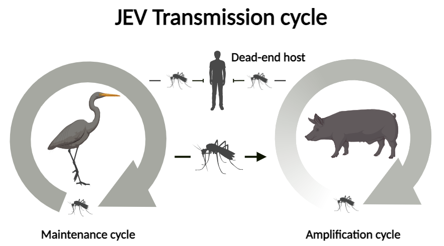
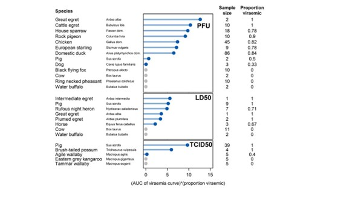

# Australian vertebrate hosts of Japanese encephalitis virus - systematic review

## 🐷 Overview

Japanese encephalitis virus (JEV) has historically been a major concern in Asia, but recent outbreaks in **Australia** have raised questions about its **transmission pathways** and **host species**. This study systematically reviewed the **vertebrate hosts** that may contribute to JEV maintenance and spread in Australia.

## 🦆 Key Findings

-   **High-Potential Hosts**: Ardeid birds (herons, egrets), **feral pigs**, and **flying foxes** may act as maintenence hosts in Australia.
-   **Domestic Pigs**: Frequently infected but their role in **amplification cycles** in Australia remains uncertain.
-   **Other hosts:** not much data, but it appears that **marsupials** are poor hosts and a wide range of **other bird species** might be good hosts.
-   **Seroprevalence Data**: Limited data suggest exposure in bats and pigs, but more research is needed.
-   **Research Gaps**: Lack of long-term surveillance and experimental infection studies on Australian species hinder our understanding of JEV transmission.

 

## 📊 Methods

-   **Systematic Review** of **20 studies** covering **22 Australian species**.
-   **Host Competence Scoring** based on experimental **viraemia levels and infection potential**.
-   **Seroprevalence analysis** using antibody detection in **wild and domestic animals**.

 

## 🦟 Implications for Disease Control

Understanding JEV's **wildlife reservoirs** is crucial for: - **Targeted surveillance** of high-risk species. - **Mosquito control strategies** near key habitats. - **Vaccine and outbreak preparedness** for both human and animal populations.

## 📄 Read the Full Paper

Moore KT, Mangan MJ, Linnegar B, Athni TS, McCallum HI, Trewin BJ, Skinner E. (2024). *Australian vertebrate hosts of Japanese encephalitis virus: a review of the evidence.*\
[🔗 Full Text](https://doi.org/10.1093/trstmh/trae079)
