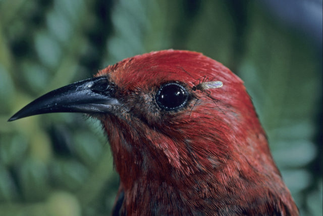

# I set out to find the best way to collect bloodfed mosquitoes at piggeries. 

### Why collect them?

We use bloodfed mosquitoes to understand mosquito feeding patterns. For example, do they feed on birds or mammals?

And crucially . . . do they feed on humans?

A mosquito that feeds on both wild animals and humans could potentially transmit a virus from the infected wild host to us!!

Each bloodfed mosquito is a crucial piece of information about vector-host connections.

### Why is it so hard to collect them?

Mosquitoes with a belly full of blood don't fly into our attractant traps. Dang!

Instead they look for a quite place to rest and digest their bloodmeal, such as a tree hallow, tall grass, or small hole.

These locations are hard to access and

